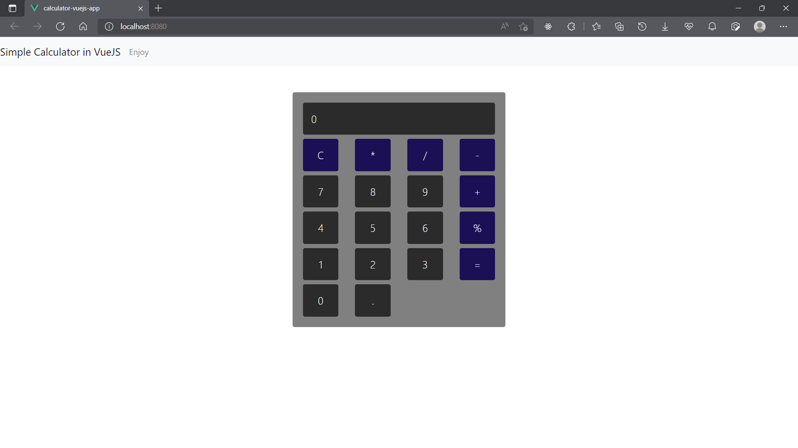
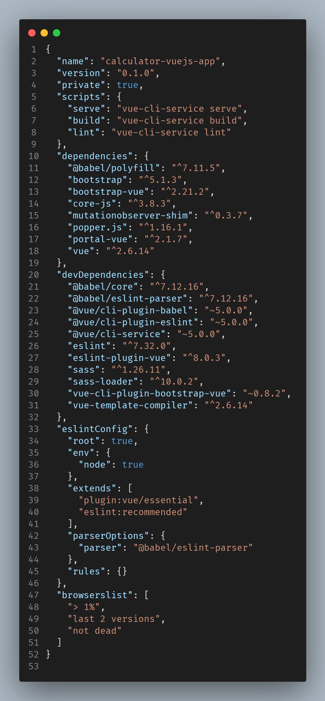

# Calculator In Vue Js

Written in JavaScript through VueJs and styled with Bootstrap Vue.



## Installation.

First of all, clone the project.
You should have Vuejs installed on your system to proceed. To install Vue, you need <a href="http://">Node Package Manager (NPM)</a> and <a href="http://nodejs.org">Node Js</a> as JavaScript runtime.

Note: I chose to use ``yarn`` as my package manager instead of npm.

To install Vue, go ahead and run:
    
    > yarn global add @vue/cli

You can install the packages I used through 

    > yarn add "the dependency"

Look into the ```package.json``` to see the used dependencies.



Install bootstrap-vue. We could do this through vue itself.

    > vue add bootstrap-vue

### That should be all folks. Now to run:

    > yarn serve

#### Thank You

Feel free to reach out to me!
geraldabuchi@twitter